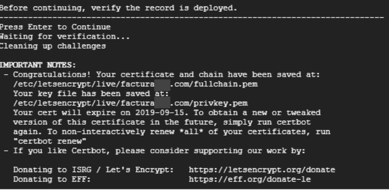

# Instalacion y configuracion del sistema

Pasos necesarios para la instalación y configuración del sistema, incluyendo la salida del editor, la asignación de permisos de ejecución al archivo 'install.sh', y la ejecución del comando con sus respectivos parámetros.

1. Para salir de editor y guardar puede presionar ***ctrl + x*** seguidamente se le consultará si desea guardar los cambios, confirme con ***y*** y luego ***enter***.

2. Debe darle permisos de ejecución al archivo:
    ```markdown
	`chmod +x install.sh`
	```

3. El comando a utilizar requiere de dos parámetros principalmente:

    ```markdown
	`./install.sh [repositorio] [dominio]`
	```

    Por ejemplo:

    ```markdown
	`./install.sh https://gitlab.com/rash07/facturadorpro2 elfacturador.com`
	```


    Una vez ejecutado el comando se iniciará un proceso donde debe ir aceptando las preguntas y que le mostrará en pantalla los valores que debe añadir en los 2 récords tipo TXT de su dominio con nombre 
	
    ```markdown
    a) **_acme-challenge.example.com**

    b) **_acme-challenge** (casos como godday y puntope)
    ```

    En la siguiente imagen le muestran el valor como v703JW.... debera copiarlo y añadirlo al primer record TXT, seguidamente pulsar enter, se le mostrará en pantalla un segundo valor para el segundo TXT:

    

4. Editados los récords en su dominio, deberá aceptar para continuar y que el proceso verifique que sea exitoso, de ser exitoso obtendrá una pantalla similar a la siguiente

    